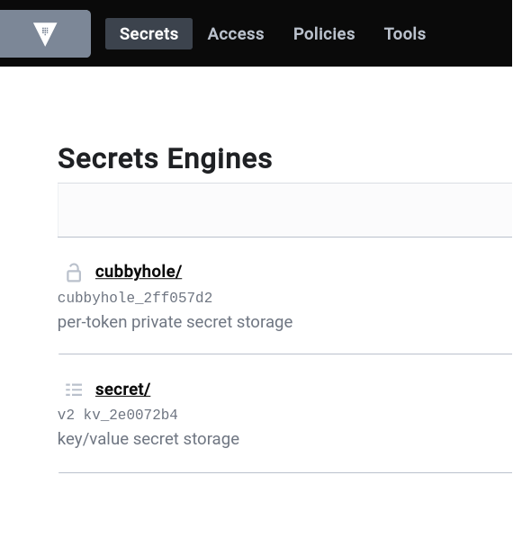

University: [ITMO University](https://itmo.ru/ru/)  
Faculty: [FICT](https://fict.itmo.ru)  
Course: [Introduction to distributed technologies](https://github.com/itmo-ict-faculty/introduction-to-distributed-technologies)  
Year: 2023/2024  
Group: K4111c  
Author: Filippov Artem Alekseevich  
Lab: Lab1  
Date of create: 01.10.2023  
Date of finished: 05.10.2023

### Цель работы

Ознакомиться с инструментами Minikube и Docker, развернуть свой первый "под".

### Ход работы

1. Docker и Minikube установлены на компьютер:

```bash
$ docker version
Client: Docker Engine - Community
 Version:           24.0.6
 API version:       1.43
 Go version:        go1.20.7
 Git commit:        ed223bc
 Built:             Mon Sep  4 12:33:40 2023
 OS/Arch:           linux/amd64
 Context:           default
...
$ minikube version
minikube version: v1.31.2
commit: fd7ecd9c4599bef9f04c0986c4a0187f98a4396e
```

2. Кластер Minilube запущен на Docker контейнере:

```bash
$ minikube status
minikube
type: Control Plane
host: Running
kubelet: Running
apiserver: Running
kubeconfig: Configured
```

3. Содзан манифест создания пода:

```yaml
apiVersion: v1
kind: Pod
metadata:
  name: "vault"
  namespace: default
  labels:
    app: "vault"
spec:
  containers:
    - name: vault
      image: "vault:1.13.3"
      ports:
        - containerPort: 8200
          name: http
```

4. Под поднят в Minikube кластере:

```bash
$ minikube kubectl -- get pod -o wide
NAME    READY   STATUS    RESTARTS   AGE    IP           NODE       NOMINATED NODE   READINESS GATES
vault   1/1     Running   0          4d1h   10.244.0.5   minikube   <none>           <none>
```

5. Создан сервис для доступа к поду:

```bash
$ minikube kubectl -- get service -o wide
NAME         TYPE        CLUSTER-IP     EXTERNAL-IP   PORT(S)          AGE    SELECTOR
...
vault        NodePort    10.98.118.55   <none>        8200:30272/TCP   4d1h   app=vault
```

6. Произведен проброс портов c локальной машины в контейнер через сервис:

```bash
minikube kubectl -- port-forward service/vault 8200:8200
Forwarding from 127.0.0.1:8200 -> 8200
Forwarding from [::1]:8200 -> 8200
```

7. Получен токен для входа в Vault:

```bash
$ docker logs db55e4b76dbf
Couldn't start vault with IPC_LOCK. Disabling IPC_LOCK, please use --cap-add IPC_LOCK
==> Vault server configuration:

             Api Address: http://0.0.0.0:8200
                     Cgo: disabled
         Cluster Address: https://0.0.0.0:8201
   Environment Variables: GODEBUG, HOME, HOSTNAME, KUBERNETES_PORT, KUBERNETES_PORT_443_TCP, KUBERNETES_PORT_443_TCP_ADDR, KUBERNETES_PORT_443_TCP_PORT, KUBERNETES_PORT_443_TCP_PROTO, KUBERNETES_SERVICE_HOST, KUBERNETES_SERVICE_PORT, KUBERNETES_SERVICE_PORT_HTTPS, PATH, PWD, SHLVL
              Go Version: go1.20.4
              Listener 1: tcp (addr: "0.0.0.0:8200", cluster address: "0.0.0.0:8201", max_request_duration: "1m30s", max_request_size: "33554432", tls: "disabled")
               Log Level:
                   Mlock: supported: true, enabled: false
           Recovery Mode: false
                 Storage: inmem
                 Version: Vault v1.13.3, built 2023-06-06T18:12:37Z
             Version Sha: 3bedf816cbf851656ae9e6bd65dd4a67a9ddff5e

==> Vault server started! Log data will stream in below:
...

You may need to set the following environment variables:

    $ export VAULT_ADDR='http://0.0.0.0:8200'

The unseal key and root token are displayed below in case you want to
seal/unseal the Vault or re-authenticate.

Unseal Key: cJY1Z4W0I3WYszrbU/vtQScBrlGINqKHFE5m+BiAM38=
Root Token: hvs.xDjQ47BXwofLm9Q5KHaHJodw

Development mode should NOT be used in production installations!
```

8. Произведен вход в Vault:



### Диаграмма


### Вывод

В результате выаолнения лаборатнорной работы был создан тестовый kubernetes кластер с помощью minikube, в котором был развернуты один под и сервис, после чего к Pod был получен удаленный доступ с помощью проброса портов. Также в ходе работы были изучены принципы формирования соединений при создании пода, сервиса и использовании проброса портов.
