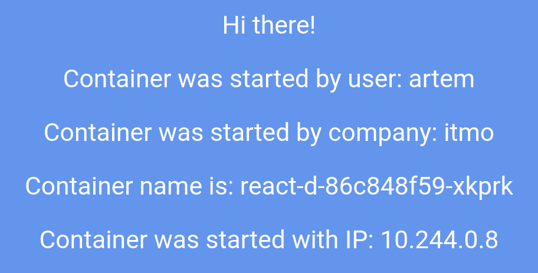

University: [ITMO University](https://itmo.ru/ru/)  
Faculty: [FICT](https://fict.itmo.ru)  
Course: [Introduction to distributed technologies](https://github.com/itmo-ict-faculty/introduction-to-distributed-technologies)  
Year: 2023/2024  
Group: K4111c  
Author: Filippov Artem Alekseevich  
Lab: Lab2  
Date of create: 07.10.2023
Date of finished:

### Цель работы

Ознакомиться с типами "контроллеров" развертывания контейнеров, ознакомится с сетевыми сервисами и развернуть свое веб приложение.

### Ход работы

1. Создан манифест deployment с двумя репликами предложенного контейнера:

```yaml
apiVersion: apps/v1
kind: Deployment
metadata:
  name: react-d
spec:
  replicas: 2
  selector:
    matchExpressions:
      - key: app
        operator: In
        values:
          - frontend
  template:
    metadata:
      labels:
        creation_method: deployment
        app: frontend
    spec:
      containers:
        - image: ifilyaninitmo/itdt-contained-frontend:master
          name: react
          env:
            - name: REACT_APP_USERNAME
              value: artem
            - name: REACT_APP_COMPANY_NAME
              value: itmo
          ports:
            - name: http
              containerPort: 8080
              protocol: TCP
```

2. Deployment развернут в Minikube кластере:

```bash
$ minikube kubectl -- get deploy -o wide
NAME      READY   UP-TO-DATE   AVAILABLE   AGE     CONTAINERS   IMAGES                                         SELECTOR
react-d   2/2     2            2           3m24s   react        ifilyaninitmo/itdt-contained-frontend:master   app in (frontend)
$ minikube kubectl -- get rs -o wide
NAME                 DESIRED   CURRENT   READY   AGE     CONTAINERS   IMAGES                                         SELECTOR
react-d-7b57c58578   2         2         2       3m44s   react        ifilyaninitmo/itdt-contained-frontend:master   app in (frontend),pod-template-hash=7b57c58578
$ minikube kubectl -- get pod -o wide
NAME                       READY   STATUS    RESTARTS   AGE   IP           NODE       NOMINATED NODE   READINESS GATES
react-d-7b57c58578-6k47h   1/1     Running   0          64s   10.244.0.7   minikube   <none>           <none>
react-d-7b57c58578-nvnnr   1/1     Running   0          64s   10.244.0.6   minikube   <none>           <none>
```

3. Создан манифест сервиса для доступа к подам:

```yaml
apiVersion: v1
kind: Service
metadata:
  name: react-np
spec:
  type: NodePort
  ports:
    - name: http
      protocol: TCP
      port: 80
      targetPort: http
      nodePort: 30123
  selector:
    app: frontend
```

4. Сервис поднят в Minikube кластере:

```bash
$ minikube kubectl -- get service -o wide
NAME         TYPE        CLUSTER-IP    EXTERNAL-IP   PORT(S)        AGE     SELECTOR
...
react-np     NodePort    10.99.14.43   <none>        80:30123/TCP   21s     app=frontend
```

5. С помощью проброса портов получен доступ к контейнерам через веб-браузер и роведена проверка, что переменные переданные контейнерам действительно передались:



6. Проверены логи контейнеров:

```bash
$ minikube kubectl -- logs pod/react-d-86c848f59-xkprk
Builing frontend
Browserslist: caniuse-lite is outdated. Please run:
  npx update-browserslist-db@latest
  Why you should do it regularly: https://github.com/browserslist/update-db#readme
Browserslist: caniuse-lite is outdated. Please run:
  npx update-browserslist-db@latest
  Why you should do it regularly: https://github.com/browserslist/update-db#readme
build finished
Server started on port 3000
```

### Диаграмма


### Вывод

В результате выаолнения лаборатнорной работы в ранее созданном кластере Minikube было развернуто два пода с помощью deployment, после чего к ним был предоставлен доступ через сервис. Также в ходе работы были изучены принципы работы Depolyment и ReplicaSet, а также принципы распределения трафика между контейнерами.
