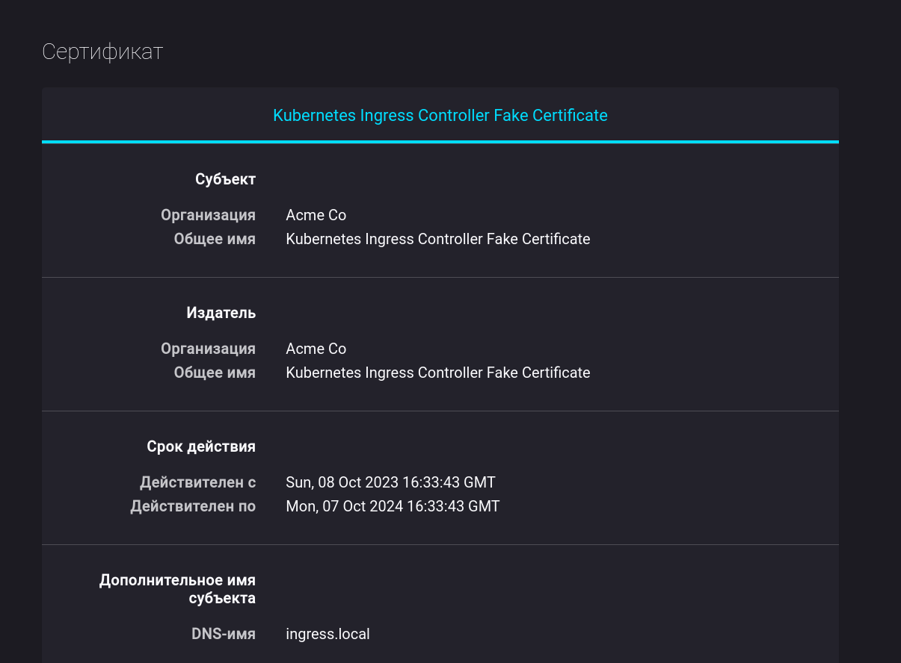

University: [ITMO University](https://itmo.ru/ru/)
Faculty: [FICT](https://fict.itmo.ru)
Course: [Introduction to distributed technologies](https://github.com/itmo-ict-faculty/introduction-to-distributed-technologies)
Year: 2023/2024
Group: K4111c
Author: Filippov Artem Alekseevich
Lab: Lab3
Date of create:
Date of finished:

### Цель работы

Познакомиться с сертификатами и "секретами" в Minikube, правилами безопасного хранения данных в Minikube.

### Ход работы

1. Создан шаблон configMap с необходимыми переменными:

```yaml
apiVersion: v1
kind: ConfigMap
metadata:
  name: react-cm
data:
  react_app_username: "artem"
  react_app_company_name: "itmo"
```

2. ConfigMap создан в кластере Minikube:

```bash
$ minikube kubectl -- get cm -o wide
NAME               DATA   AGE
...
react-cm           2      18m
```

3. Создан шаблон replicaSet, использующий значения из созданной configMap:

```yaml
apiVersion: apps/v1
kind: ReplicaSet
metadata:
  name: react-rs
spec:
  replicas: 2
  selector:
    matchExpressions:
      - key: app
        operator: In
        values:
          - frontend
  template:
    metadata:
      labels:
        creation_method: replicaSet
        app: frontend
    spec:
      containers:
        - image: ifilyaninitmo/itdt-contained-frontend:master
          name: react
          env:
            - name: REACT_APP_USERNAME
              valueFrom:
                configMapKeyRef:
                  name: react-cm
                  key: react_app_username
            - name: REACT_APP_COMPANY_NAME
              valueFrom:
                configMapKeyRef:
                  name: react-cm
                  key: react_app_company_name
          ports:
            - name: http
              containerPort: 3000
              protocol: TCP
```

4. ReplicaSet развернут в кластере Minikube:

```bash
$ minikube kubectl -- get rs -o wide
NAME       DESIRED   CURRENT   READY   AGE   CONTAINERS   IMAGES                                         SELECTOR
react-rs   2         2         2       22m   react        ifilyaninitmo/itdt-contained-frontend:master   app in (frontend)
$ minikube kubectl -- get pod -o wide
NAME             READY   STATUS    RESTARTS   AGE     IP            NODE       NOMINATED NODE   READINESS GATES
react-rs-99p86   1/1     Running   0          2m26s   10.244.0.15   minikube   <none>           <none>
react-rs-q267p   1/1     Running   0          2m26s   10.244.0.16   minikube   <none>           <none>
```

5. Включен minikube addons enable ingress и сгенерирован TLS сертификат:

```bash
$ minikube addons enable ingress
...
🌟  The 'ingress' addon is enabled
```

```bash
$ openssl req -new -newkey rsa:4096 -x509 -sha256 -days 365 -nodes -out minikube.crt -keyout minikube.key
...
Country Name (2 letter code) [XX]:RU
State or Province Name (full name) []:SPB
Locality Name (eg, city) [Default City]:SPB
Organization Name (eg, company) [Default Company Ltd]:ITMO
Organizational Unit Name (eg, section) []:BEL6
Common Name (eg, your name or your server's hostname) []:ART
```

6. Сертификат импортирован в Minikube:

```bash
$ minikube kubectl -- create secret tls ingress-tls --cert minikube.crt --key minikube.key
secret/ingress-tls created
$ minikube kubectl -- get secret -o wide
NAME          TYPE                DATA   AGE
ingress-tls   kubernetes.io/tls   2      71s
```

7. Создан шаблон ingress с использованием tls сертификата:

```yaml
apiVersion: networking.k8s.io/v1
kind: Ingress
metadata:
  name: ingress-services
spec:
  tls:
    - hosts:
        - kube.example.com
      secretName: ingress-tls
  rules:
    - host: kube.example.com
      http:
        paths:
          - pathType: Prefix
            path: /react
            backend:
              service:
                name: react-np
                port:
                  number: 80
```

8. Ingress развернут в кластере Minikube:

```bash
$ minikube kubectl -- get ingress -o wide
NAME               CLASS   HOSTS              ADDRESS   PORTS     AGE
ingress-services   nginx   kube.example.com             80, 443   18s
```

9.  В hosts прописан FQDN и IP адрес созанного ingress:

```bash
$ cat /etc/hosts
...
192.168.49.2 kube.example.com
```

10. Осуществленна проверка наличия сертификата веб приложения:



### Диаграмма


### Вывод

В результате выаолнения лаборатнорной работы в ранее созданном кластере Minikube
