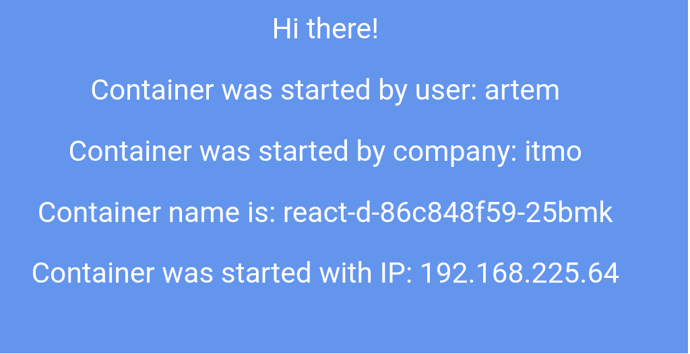

University: [ITMO University](https://itmo.ru/ru/)
Faculty: [FICT](https://fict.itmo.ru)
Course: [Introduction to distributed technologies](https://github.com/itmo-ict-faculty/introduction-to-distributed-technologies)
Year: 2023/2024
Group: K4111c
Author: Filippov Artem Alekseevich
Lab: Lab4
Date of create: 13.10.2023
Date of finished:

### Цель работы

Познакомиться с CNI Calico и функцией IPAM Plugin, изучить особенности работы CNI и CoreDNS.

### Ход работы

1. Развернут Minikube на двух узлах с установленным плагином Calico:

```bash
$ kubectl get pods -A
NAMESPACE     NAME                                       READY   STATUS    RESTARTS        AGE
kube-system   calico-kube-controllers-85578c44bf-76fnf   1/1     Running   1 (5m43s ago)   5m59s
kube-system   calico-node-28gj5                          1/1     Running   0               5m55s
kube-system   calico-node-mbbdz                          1/1     Running   0               5m59s
...
$ kubectl get nodes
NAME                 STATUS   ROLES           AGE     VERSION
multinode-demo       Ready    control-plane   6m26s   v1.27.4
multinode-demo-m02   Ready    <none>          6m6s    v1.27.4
```

2. Добавлены метки узлам по признаку стойки:

```bash
$ kubectl get nodes --show-labels
NAME                 STATUS   ROLES           AGE   VERSION   LABELS
multinode-demo       Ready    control-plane   15h   v1.27.4   beta.kubernetes.io/arch=amd64...,rack=225
multinode-demo-m02   Ready    <none>          15h   v1.27.4   beta.kubernetes.io/arch=amd64...,rack=224
```

3. Создан манифест Calico для автоматического назначения ip подам:

```yaml
apiVersion: projectcalico.org/v3
kind: IPPool
metadata:
  name: rack-224-ippool
spec:
  cidr: 192.168.224.0/24
  ipipMode: Always
  natOutgoing: true
  nodeSelector: rack == "224"
---
apiVersion: projectcalico.org/v3
kind: IPPool
metadata:
  name: rack-225-ippool
spec:
  cidr: 192.168.225.0/24
  ipipMode: Always
  natOutgoing: true
  nodeSelector: rack == "225"
```

4. Скачан плагин для kubectl (kubectl-calico) для работы с Calico resources:

```bash
$ curl -L https://github.com/projectcalico/calico/releases/download/v3.26.3/calicoctl-linux-amd64 -o kubectl-calico
$ chmod +x kubectl-calico
$ sudo mv kubectl-calico /usr/bin/
```

5. IPPools развернуты в кластере Minikube, а также удален дефолтный ippool:

```bash
$ kubectl calico delete ippools default-ipv4-ippool
$ kubectl calico create -f lab4/IPAM.yaml --allow-version-mismatch
Successfully created 2 'IPPool' resource(s)
$ kubectl get ippools -o wide
NAME                  AGE
rack-224-ippool       19s
rack-225-ippool       19s
```

6. Создане манифест depolyment согласно заданию:

```yaml
apiVersion: apps/v1
kind: Deployment
metadata:
  name: react-d
spec:
  replicas: 2
  selector:
    matchExpressions:
      - key: app
        operator: In
        values:
          - frontend
  template:
    metadata:
      labels:
        creation_method: deployment
        app: frontend
    spec:
      containers:
        - image: ifilyaninitmo/itdt-contained-frontend:master
          name: react
          env:
            - name: REACT_APP_USERNAME
              value: artem
            - name: REACT_APP_COMPANY_NAME
              value: itmo
          ports:
            - name: http
              containerPort: 3000
              protocol: TCP
```

7. Deployment развернут в кластере Mininkube:

```bash
$ kubectl get deploy -o wide
NAME      READY   UP-TO-DATE   AVAILABLE   AGE   CONTAINERS   IMAGES                                         SELECTOR
react-d   2/2     2            2           29s   react        ifilyaninitmo/itdt-contained-frontend:master   app in (frontend)
$ kubectl get rs -o wide
NAME                DESIRED   CURRENT   READY   AGE   CONTAINERS   IMAGES                                         SELECTOR
react-d-86c848f59   2         2         0       16s   react        ifilyaninitmo/itdt-contained-frontend:master   app in (frontend),pod-template-hash=86c848f59
$ kubectl get pods -o wide
NAME                      READY   STATUS    RESTARTS   AGE   IP                NODE                 NOMINATED NODE   READINESS GATES
react-d-86c848f59-25bmk   1/1     Running   0          9s    192.168.225.64    multinode-demo       <none>           <none>
react-d-86c848f59-krrw5   1/1     Running   0          9s    192.168.224.196   multinode-demo-m02   <none>           <none>
```

8. Создан манифест сервиса для обеспечения доступа к подам:

```yaml
apiVersion: v1
kind: Service
metadata:
  name: react-np
spec:
  type: NodePort
  ports:
    - name: http
      protocol: TCP
      port: 80
      targetPort: http
      nodePort: 30123
  selector:
    app: frontend
```

9. Сервис развернут в кластере Minikube:

```bash
$ kubectl get service -o wide
NAME         TYPE        CLUSTER-IP     EXTERNAL-IP   PORT(S)        AGE   SELECTOR
kubernetes   ClusterIP   10.96.0.1      <none>        443/TCP        17h   <none>
react-np     NodePort    10.96.187.24   <none>        80:30123/TCP   13s   app=frontend
```

10. Получен доступ к подам через ip контейнера (Minikube узла) и проверены значения Container name и Container IP:



11. Осуществлена проверка достпуности подов с помощью пинга FQDN имени соседнего пода:

```bash
$ nslookup 192.168.225.64
Server:         10.96.0.10
Address:        10.96.0.10:53

64.225.168.192.in-addr.arpa     name = 192-168-225-64.react-np.default.svc.cluster.local

$ ping 192-168-225-64.react-np.default.svc.cluster.local
PING 192-168-225-64.react-np.default.svc.cluster.local (192.168.225.64): 56 data bytes
64 bytes from 192.168.225.64: seq=0 ttl=62 time=0.141 ms
64 bytes from 192.168.225.64: seq=1 ttl=62 time=0.185 ms
64 bytes from 192.168.225.64: seq=2 ttl=62 time=0.134 ms
^C
--- 192-168-225-64.react-np.default.svc.cluster.local ping statistics ---
3 packets transmitted, 3 packets received, 0% packet loss
round-trip min/avg/max = 0.134/0.153/0.185 ms
```

### Диаграмма


### Вывод

В результате выаолнения лаборатнорной работы был создан тестовый двухузловой kubernetes кластер с помощью minikube и CNI Calico. В созданном кастере были созданы ippools для каждого узла, после чего была осуществленна проверка привязки ip адресов, путем создания двух подов с помощью deployment.
